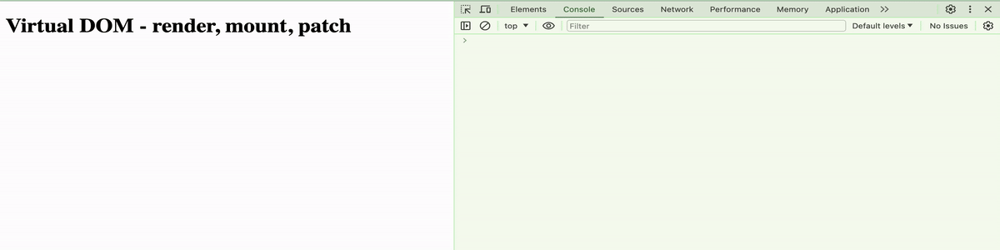

---
## Mini Vue Implementation

---

This project is a simplified implementation of Vue's core features, designed to demonstrate the fundamental concepts of a reactivity system using virtual DOM techniques. It includes custom `render`, `mount`, and `patch` functions that mimic Vue's handling of DOM updates and reactive data binding. The goal is to provide a hands-on example of how Vue's reactivity engine operates under the hood, making it easier to understand the lifecycle of reactive components and the virtual DOM update mechanism.

<!--  -->

